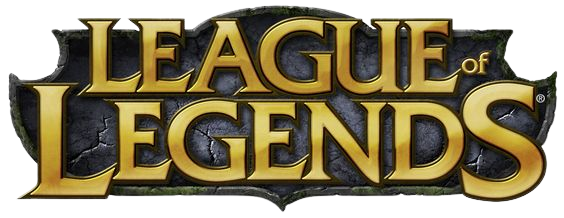
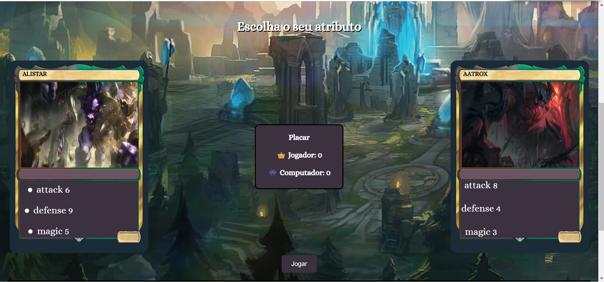

## Índice

- [1. Super Trunfo - League of Legends](#-super-trunfo---league-of-legends)
- [2. Refatoração do projeto](#-refatoração-do-projeto)
- [3. Implementações futuras](#-implementações-futuras)
- [4. Projeto final](#projeto-final)
- [5. Desenvolvedoras](#desenvolvedoras)

# 1. Super Trunfo - League of Legends

A [Laboratoria](https://www.laboratoria.la/br) nos desafiou a escolher o [projeto](https://github.com/Laboratoria/SAP007-data-lovers) de uma das integrantes do grupo, projeto esse que foi entregue em outro momento do Bootcamp e desenvolver um produto novo a partir dele. Fizemos uma pesquisa de usuário onde nos levou criar um jogo de cartas utilizando os personagens do Leage Of Legends baseado no [projeto](https://vanessavb92.github.io/SAP007-data-lovers/src/) da Vanessa.
Foi então que surgiu o [SuperTrunfo Lol](https://juliabb.github.io/super-trunfo-lol/). Ele é um jogo de cartas que se baseia na comparação dos valores da carta do usuário com os valores da carta do adversário. E para vencer, a característica escolhida precisa ter valor maior do que o atributo escolhido pelo adversário, no caso, o usuário estará jogando contra a máquina. 

* Desenvolvido por:

[Dayane Maryssol](https://www.linkedin.com/in/dayannemaryssol/), [Julia Benedicto](https://www.linkedin.com/in/julia-cruz-7aa339183/), [Keila Hadama](https://www.linkedin.com/in/keila-hadama/), [Taila Martins](https://www.linkedin.com/in/taila-martins/), [Thais Bonalume](https://www.linkedin.com/in/thais-moreira-jesus-bonalume/) e [Vanessa Borges](https://www.linkedin.com/in/vanessa-borges-a05b4636/).

---
# 2. Refatoração do projeto

A refatoração do projeto foi feita após um teste de usabilidade, onde os participantes realizaram tarefas típicas enquanto nós obervamos e anotamos. O projeto apresentado para tal teste foi [esse](https://juliabb.github.io/super-trunfo-lol/): 

- Fizemos as seguintes perguntas durante o processo de teste:

O que você achou do layout? 
A jogabilidade foi fácil? 
É compreensível o modo de jogo? 
Há algo que você gostaria que mudassêmos? 

- Os resultados da pesquisa:

<!-- imagem  do teste de usabilidade -->

---
<!-- # 3. Implementações futuras

- Adicionar um segundo player.
- Responsividade para dispositivos de telas pequenas (tablets, telefones celulares etc.).
 -->

---
# 4. Projeto final

# 5. Desenvolvedoras

<table>
<td>
  

     
  

  <h3 align="center"><a href="https://github.com/Maryssun">Dayanne Maryssol</a></h3>
  <h4 align="center">Projeto do Bootcamp da <em><a href="https://hub.laboratoria.la/br">Laboratoria</a></em></h4>
  

     
  

  

</td>

<td>
  

     
  

  <h3 align="center"><a href="https://github.com/hadamakei">Keila Hadama</a></h3>
  <h4 align="center">Projeto do Bootcamp da <em><a href="https://hub.laboratoria.la/br">Laboratoria</a></em></h4>
  

    
  

</td>

<td>
    

     
  

  <h3 align="center"><a href="https://github.com/vanessavb92">Vanessa Borges</a></h3>
  <h4 align="center">Projeto do Bootcamp da <em><a href="https://hub.laboratoria.la/br">Laboratoria</a></em></h4>
  

    
  

   
</td>

</table>
